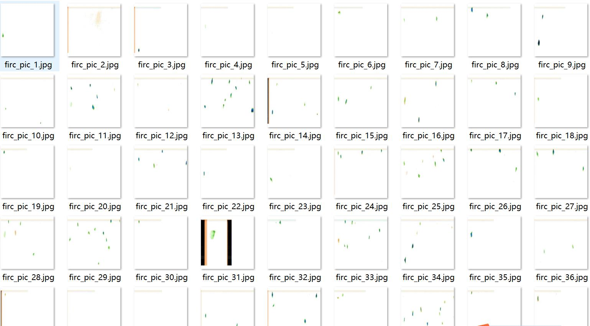
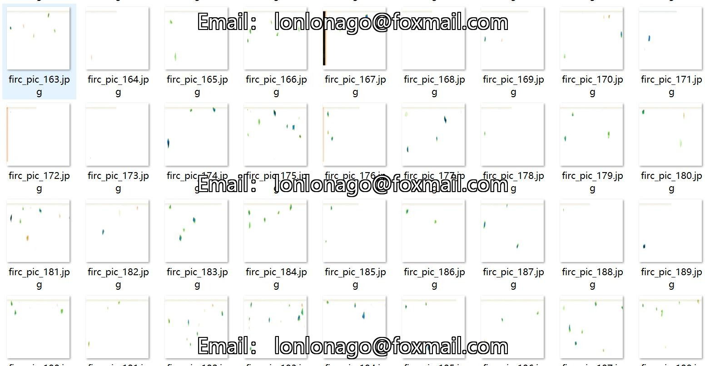
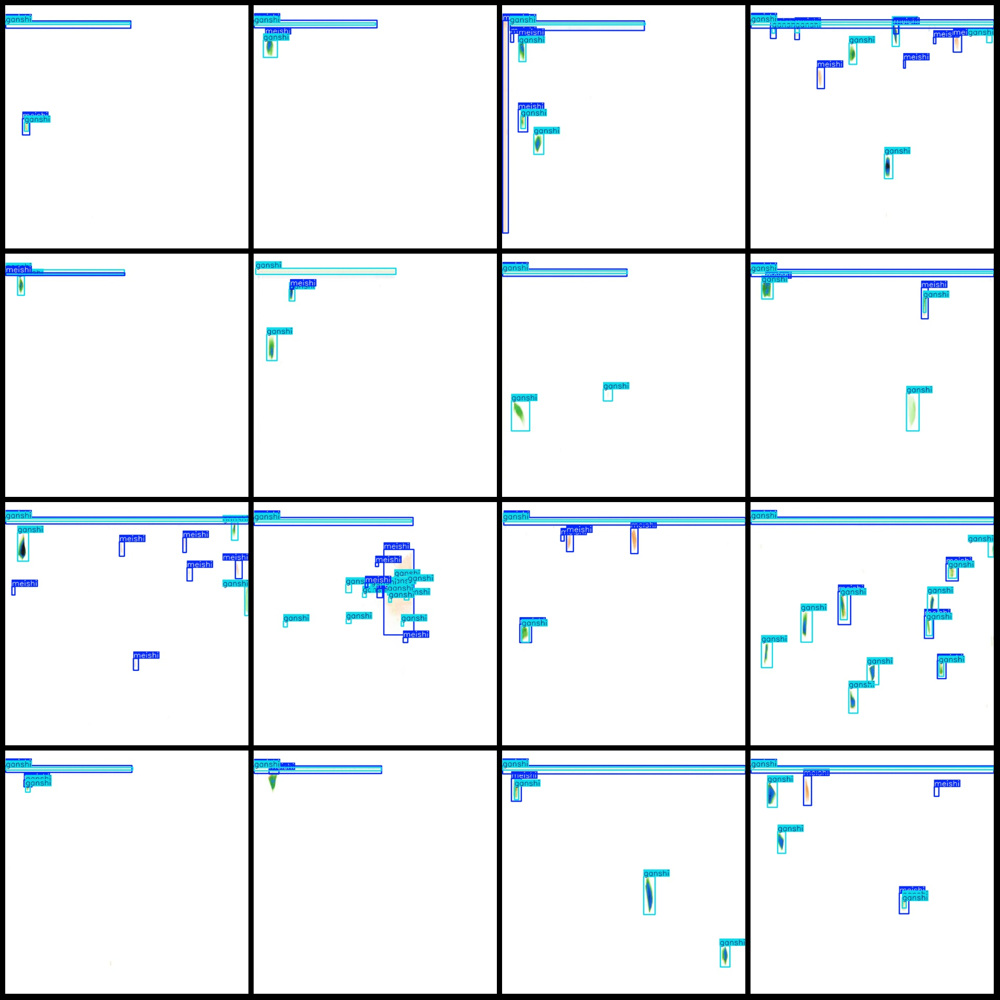
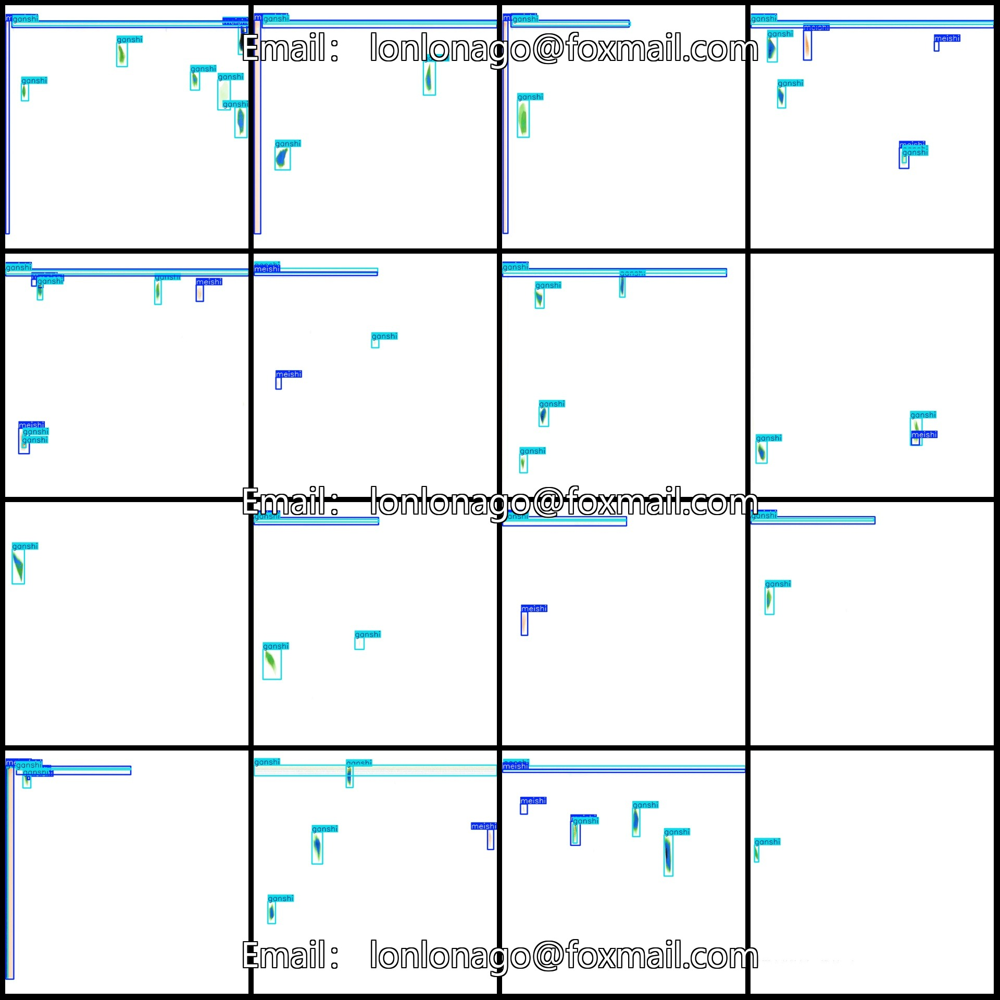
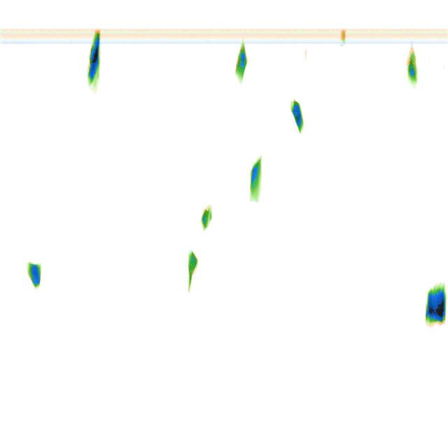

# Intelligent Industrial X-ray Image Coal Gangue Detection Dataset - VOC+YOLO Format - 447 Images in 3 Categories

**Dataset Format:** Pascal VOC format + YOLO format (txt file without split path, only containing jpg images along with corresponding VOC format xml files and yolo format txt files)

**Number of Images (jpg Files):** 447

**Number of Annotations (xml Files):** 447

**Number of Annotations (txt Files):** 447

**Number of Annotation Categories:** 3

**Annotation Category Names (Note that the order of categories in the yolo format may not match this, but is based on the labels folder 'classes.txt'):** ["ganshi", "luansezawu", "meishi"]

**Number of Boxes per Category:**
- ganshi (Ganshi): 1450 boxes
- luansezawu (Blue Trash): 2 boxes
- meishi (Coal): 1045 boxes

**Total Boxes:** 2497

**Number of Pictures per Category:**
- ganshi (Ganshi): 437 pictures
- luansezawu (Blue Trash): 2 pictures
- meishi (Coal): 397 pictures

**Image Resolution:** 640x640

**Annotation Tool:** labelImg

**Annotation Rules:** Draw rectangle boxes for each category

**Important Note:** The dataset does not have been split into training, validation, or test sets; you must do so yourself.

**Special Disclaimer:** This dataset does not guarantee any accuracy in the trained models or weight files.

**Image Preview:** 

---

## Images

Here is a pay link on Stripe ( https://buy.stripe.com/3cs8yP7sY87d0vu9AB ). Please contact me lonlonago@foxmail.com after funding $89, and I will send you a complete data files , thank you!

